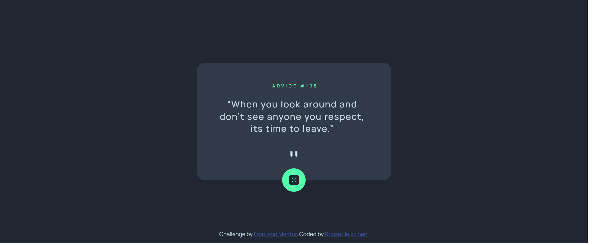

# Frontend Mentor - Advice generator app solution

This is a solution to the [Advice generator app challenge on Frontend Mentor](https://www.frontendmentor.io/challenges/advice-generator-app-QdUG-13db). Frontend Mentor challenges help you improve your coding skills by building realistic projects.

## Table of contents

- [Overview](#overview)
  - [The challenge](#the-challenge)
  - [Screenshot](#screenshot)
  - [Links](#links)
- [My process](#my-process)
  - [Built with](#built-with)
  - [What I learned](#what-i-learned)
  - [Continued development](#continued-development)
- [Author](#author)

## Overview

### The challenge

Your challenge is to build out this advice generator app using the [Advice Slip API](https://api.adviceslip.com) and get it looking as close to the design as possible.

Users should be able to:

- View the optimal layout for the app depending on their device's screen size
- See hover states for all interactive elements on the page
- Generate a new piece of advice by clicking the dice icon

### Screenshot

### Links

- Solution URL: [Add solution URL here](https://your-solution-url.com)
- Live Site URL: [https://advicegeneratormentor.netlify.app/](https://advicegeneratormentor.netlify.app/)

## My process

### Built with

- HTML
- CSS 
- Javascript 

### What I learned

I rehearsed the use of an API and got to know the fetch method. 
I learned to present the information from the API when the window loads. 
I also learned about CSS media query method. I will need to familiarize myself with this topic when going forward. 

### Continued development

I'm going to focus on building responsive layout and get to know more about different CSS properties. I am going to start the next project with mobile first approach. 

## Author

- Website - [Roosa Heikkinen](https://roosaheikkinen.netlify.app/)
- Frontend Mentor - [@RosbaEve](https://www.frontendmentor.io/profile/RosbaEve)
- Github - [@RosbaEve](https://github.com/RosbaEve)

